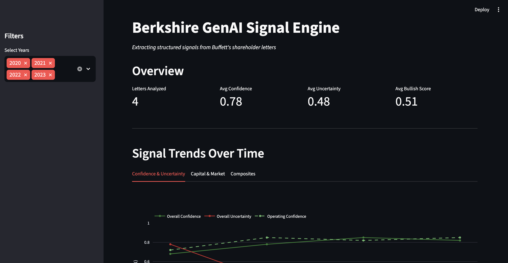

# Berkshire GenAI Signal Engine

> Extract structured financial signals from Warren Buffett's shareholder letters using LLMs, then analyze correlations with stock performance.



[](https://www.python.org/downloads/)
[](https://opensource.org/licenses/MIT)

---

## 🎯 What This Project Does

This project demonstrates **practical GenAI application in finance** by:

1. **Extracting 25+ structured signals** from Berkshire Hathaway shareholder letters using Claude
2. **Quantifying qualitative language** — converting Buffett's prose into normalized scores
3. **Correlating signals with returns** — comparing extracted sentiment to actual stock performance
4. **Visualizing trends** — interactive dashboard showing how signals evolve over time

### Why Berkshire Letters?

- **Consistent author** — Buffett has written them for 50+ years
- **Domain-specific vocabulary** — "float," "elephant hunting," "Mr. Market"
- **Measurable outcomes** — BRK stock performance provides ground truth
- **Interview-ready** — demonstrates finance domain knowledge + AI application

---

## 📊 Signal Schema

The extraction captures Berkshire-specific indicators, not generic sentiment:

| Category | Signals | Type |
|----------|---------|------|
| **Confidence** | Overall, Operating, Portfolio, Succession | 0-1 scale |
| **Uncertainty** | Overall, Macro, Market, Operational | 0-1 scale |
| **Capital Allocation** | Posture, Cash Intent, Buyback Enthusiasm | Enum + 0-1 |
| **Market Commentary** | Regime, Valuation Concern, Opportunity Richness | Enum + 0-1 |
| **Insurance/Float** | Emphasis, Outlook, Underwriting Discipline | Enum + 0-1 |
| **Acquisitions** | Stance, Elephant Hunting, Deal Environment | Enum + 0-1 |
| **Composites** | Bullish Score, Defensive Score | Computed |

See [`docs/SCORING_GUIDE.md`](docs/SCORING_GUIDE.md) for detailed definitions.

---

## 🏗️ Architecture

```
┌─────────────────────────────────────────────────────────────────────┐
│                     BERKSHIRE SIGNAL ENGINE                         │
├─────────────────────────────────────────────────────────────────────┤
│                                                                     │
│   LETTERS              EXTRACTION              SIGNALS              │
│   ┌─────────┐         ┌───────────┐         ┌─────────────┐        │
│   │ 2020.txt│─────────│  Claude   │─────────│ Pydantic    │        │
│   │ 2021.txt│         │  API +    │         │ Validated   │        │
│   │ 2022.txt│         │  Prompts  │         │ JSON        │        │
│   │ 2023.txt│         └───────────┘         └──────┬──────┘        │
│   └─────────┘                                      │               │
│                                                    ▼               │
│   MARKET DATA          MERGE                 ANALYSIS              │
│   ┌─────────┐         ┌───────────┐         ┌─────────────┐        │
│   │ BRK-B   │─────────│  Dataset  │─────────│ Correlations│        │
│   │ yfinance│         │  Builder  │         │ Trends      │        │
│   │ Returns │         │           │         │ Dashboard   │        │
│   │ Vol     │         └───────────┘         └─────────────┘        │
│   └─────────┘                                                      │
│                                                                     │
└─────────────────────────────────────────────────────────────────────┘
```

---

## 🚀 Quick Start

### 1. Clone and Install

```bash
git clone https://github.com/CraziedAres/berkshire-genai-signal-engine.git
cd berkshire-genai-signal-engine

# Create virtual environment
python3 -m venv .venv
source .venv/bin/activate

# Install dependencies
pip install anthropic pydantic pandas yfinance streamlit plotly python-dotenv
```

### 2. Run the Dashboard (No API Key Needed)

The repo includes sample signals for 2020-2023, so you can explore immediately:

```bash
streamlit run app.py
```

Open http://localhost:8501 in your browser.

### 3. Extract Your Own Signals (Requires API Key)

```bash
# Set up API key
cp .env.example .env
# Edit .env with your Anthropic API key from https://console.anthropic.com

# Add letter text files to data/letters/
# Then extract signals
python scripts/extract_all.py

# Rebuild the dataset
python scripts/build_dataset.py
```

---

## 📈 Sample Results

### Signal Trends (2020-2023)

| Year | Event | Confidence | Uncertainty | Capital Posture |
|------|-------|------------|-------------|-----------------|
| 2020 | COVID pandemic | 0.68 ↓ | 0.78 ↑ | `defensive` |
| 2021 | SPAC/meme mania | 0.78 → | 0.42 ↓ | `accumulate_cash` |
| 2022 | Rising rates | 0.85 ↑ | 0.35 ↓ | `aggressive_deploy` |
| 2023 | Munger tribute | 0.82 → | 0.38 → | `accumulate_cash` |

### Key Correlations Found

| Signal | vs 90-Day Return | Interpretation |
|--------|------------------|----------------|
| Operating Confidence | -0.99 | Higher confidence → lower returns (buy the fear?) |
| Macro Uncertainty | +0.92 | Higher uncertainty → higher returns |
| Cat Exposure Concern | +0.90 | Insurance caution correlates with gains |

*Note: 4 data points — correlations are illustrative, not predictive.*

---

## 📁 Project Structure

```
berkshire-genai-signal-engine/
├── README.md
├── pyproject.toml           # Dependencies
├── app.py                   # Streamlit dashboard
│
├── src/
│   ├── schema.py            # Pydantic models (25+ signals)
│   ├── prompts.py           # LLM extraction prompts
│   ├── extractor.py         # Claude API integration
│   ├── market.py            # Stock data pipeline
│   ├── dataset.py           # Signal + market merger
│   └── analyzer.py          # Analysis helpers
│
├── scripts/
│   ├── extract_all.py       # Batch signal extraction
│   └── build_dataset.py     # Dataset builder
│
├── data/
│   ├── letters/             # Raw letter text (2020-2023.txt)
│   └── signals/             # Extracted signals (JSON)
│
└── docs/
    ├── SCORING_GUIDE.md     # Signal definitions
    └── EXAMPLE_EXTRACTION.json
```

---

## 🔧 Tech Stack

| Component | Technology | Why |
|-----------|------------|-----|
| Signal Extraction | Claude API | Best-in-class instruction following |
| Schema Validation | Pydantic | Type safety, JSON serialization |
| Market Data | yfinance | Free, reliable, widely used |
| Data Processing | pandas | Industry standard |
| Dashboard | Streamlit | Fast to build, interactive |
| Visualization | Plotly | Interactive charts |

---

## 🎓 Interview Talking Points

This project demonstrates:

1. **Domain Expertise** — Berkshire-specific signals, not generic sentiment
2. **Structured Extraction** — Converting unstructured text to validated schemas
3. **Prompt Engineering** — Scoring guidance, enum constraints, evidence requirements
4. **Data Pipeline Design** — Modular architecture, caching, feature engineering
5. **Financial Analysis** — Return calculations, volatility, correlation analysis
6. **Production Mindset** — Type validation, error handling, documentation

### Sample Interview Q&A

**Q: Why not just use generic sentiment analysis?**
> Generic sentiment misses domain-specific signals like "float emphasis" or "elephant hunting appetite" that are unique to Berkshire. The schema captures 25+ Berkshire-specific indicators with clear definitions.

**Q: How do you ensure extraction quality?**
> Three mechanisms: (1) Pydantic validation enforces schema compliance, (2) rationale fields require the LLM to cite evidence, (3) enum constraints prevent drift in categorical fields.

**Q: What would you do differently in production?**
> Add evaluation metrics comparing extractions across models, implement human-in-the-loop review for edge cases, and build a feedback loop to refine prompts based on analyst corrections.

---

## 📄 License

MIT License — see [LICENSE](LICENSE) for details.

---

## 🙏 Acknowledgments

- Warren Buffett and Charlie Munger for decades of shareholder letters
- Anthropic for Claude API
- Built with assistance from Claude Code

---

*Built for learning and demonstration purposes. Not financial advice.*
